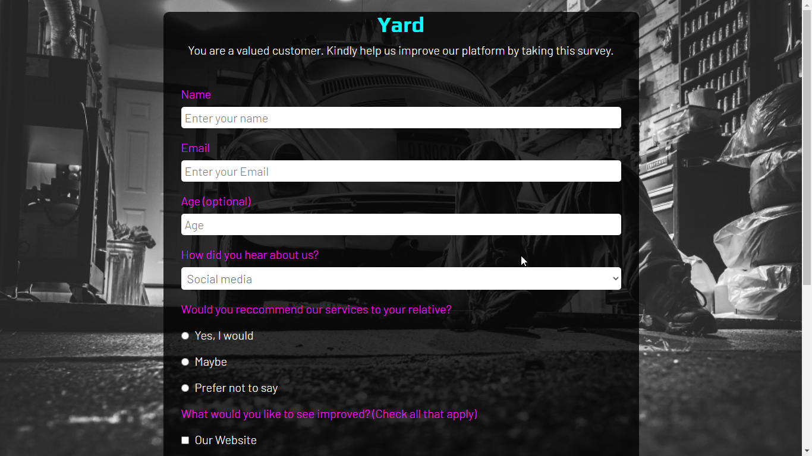

## Survey Form

Survey forms are used to collect important information

I built this form as the first project while taking Freecodecamp's Responsive Web Design Certification

### Tools

I used HTML and CSS

[View Live Site](https://dezynre.github.io/SurveyForm/)